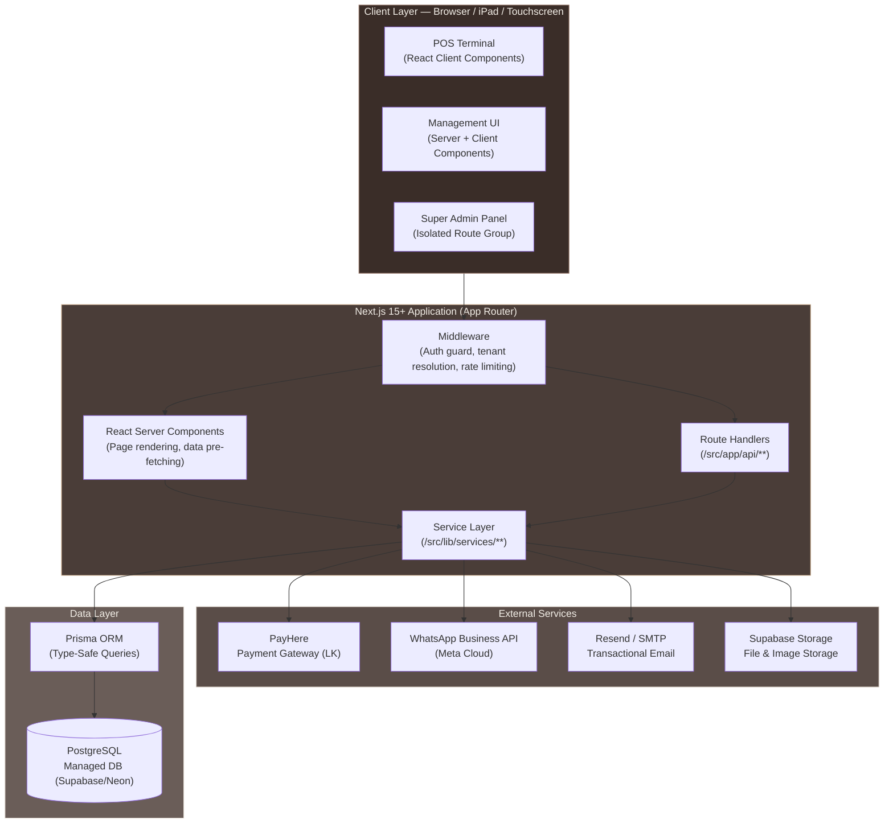
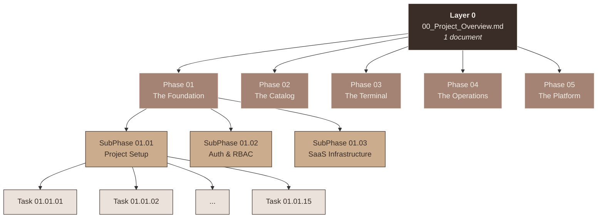
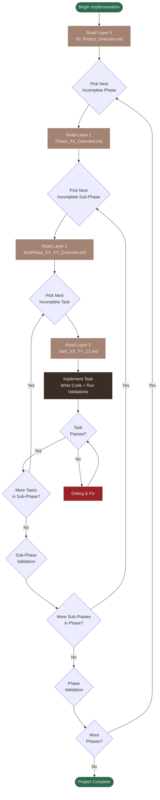

# VelvetPOS — Clothing Store POS & Inventory Management SaaS

## Project Overview & Master Document

---

| Field              | Value                                                               |
| ------------------ | ------------------------------------------------------------------- |
| **Project Name**   | VelvetPOS — Clothing Store POS & Inventory Management SaaS          |
| **Version**        | 1.0.0                                                               |
| **Document Type**  | Layer 0 — Top-Level Project Overview (DDD Master)                   |
| **Status**         | Draft / Blueprint                                                   |
| **Created**        | 2026-03-16                                                          |
| **Last Updated**   | 2026-03-16                                                          |
| **Architecture**   | Full-Stack SaaS Web Application (Single-Tenant, SaaS-Ready)         |
| **Methodology**    | Document-Driven Development (DDD) with Agentic AI                   |
| **Deployment**     | Cloud-hosted, accessible via custom subdomain                       |
| **Primary Client** | Single local clothing store — Sri Lanka                             |

---

## Table of Contents

- [VelvetPOS — Clothing Store POS \& Inventory Management SaaS](#velvetpos--clothing-store-pos--inventory-management-saas)
  - [Project Overview \& Master Document](#project-overview--master-document)
  - [Table of Contents](#table-of-contents)
  - [1. Project Vision \& Executive Summary](#1-project-vision--executive-summary)
    - [1.1 What Is VelvetPOS?](#11-what-is-velvetpos)
    - [1.2 Why Does VelvetPOS Exist?](#12-why-does-velvetpos-exist)
    - [1.3 Target Audience](#13-target-audience)
    - [1.4 Core Design Principles](#14-core-design-principles)
  - [2. Core Architecture Overview](#2-core-architecture-overview)
    - [2.1 System Design Philosophy](#21-system-design-philosophy)
    - [2.2 Technology Stack Summary](#22-technology-stack-summary)
    - [2.3 System Architecture Diagram](#23-system-architecture-diagram)
  - [3. Data Architecture Summary](#3-data-architecture-summary)
    - [3.1 Database Choice Rationale](#31-database-choice-rationale)
    - [3.2 Core Models](#32-core-models)
      - [3.2.1 `Tenant`](#321-tenant)
      - [3.2.2 `User`](#322-user)
      - [3.2.3 `Product` \& `ProductVariant`](#323-product--productvariant)
      - [3.2.4 `Sale` \& `SaleItem`](#324-sale--saleitem)
      - [3.2.5 `Customer`](#325-customer)
      - [3.2.6 `Subscription`](#326-subscription)
    - [3.3 Model Relationships](#33-model-relationships)
  - [4. System Directory Structure](#4-system-directory-structure)
  - [5. Key Module Descriptions](#5-key-module-descriptions)
    - [5.1 SaaS Infrastructure \& Tenant Management Module](#51-saas-infrastructure--tenant-management-module)
    - [5.2 Authentication \& Authorization Module (NextAuth)](#52-authentication--authorization-module-nextauth)
    - [5.3 POS Terminal Module](#53-pos-terminal-module)
    - [5.4 Inventory \& Product Catalog Module](#54-inventory--product-catalog-module)
    - [5.5 Subscription Billing Module (PayHere)](#55-subscription-billing-module-payhere)
    - [5.6 WhatsApp Integration Module](#56-whatsapp-integration-module)
    - [5.7 Reporting \& Analytics Module](#57-reporting--analytics-module)
  - [6. API Surface Overview](#6-api-surface-overview)
    - [6.1 API Design Philosophy](#61-api-design-philosophy)
    - [6.2 Route Groups \& Namespacing](#62-route-groups--namespacing)
    - [6.3 API Endpoint Reference Table](#63-api-endpoint-reference-table)
  - [7. UI Design System](#7-ui-design-system)
    - [7.1 Design Philosophy](#71-design-philosophy)
    - [7.2 Color Palette](#72-color-palette)
    - [7.3 Typography](#73-typography)
    - [7.4 Component Standards](#74-component-standards)
    - [7.5 Layout System](#75-layout-system)
  - [8. Document-Driven Development (DDD) Methodology](#8-document-driven-development-ddd-methodology)
    - [8.1 What Is DDD?](#81-what-is-ddd)
    - [8.2 Why DDD with Agentic AI?](#82-why-ddd-with-agentic-ai)
    - [8.3 How the Layered Documents Work](#83-how-the-layered-documents-work)
  - [9. Document Series Architecture](#9-document-series-architecture)
    - [9.1 Full Hierarchy Diagram](#91-full-hierarchy-diagram)
    - [9.2 Document Counts per Level](#92-document-counts-per-level)
    - [9.3 Document Hierarchy — Mermaid Diagram](#93-document-hierarchy--mermaid-diagram)
  - [10. Document Naming Conventions](#10-document-naming-conventions)
    - [10.1 Folder Naming Rules](#101-folder-naming-rules)
    - [10.2 File Naming Rules](#102-file-naming-rules)
    - [10.3 Full Naming Examples](#103-full-naming-examples)
  - [11. How to Use This Document Series (For AI Agents)](#11-how-to-use-this-document-series-for-ai-agents)
    - [11.1 Step-by-Step Navigation Protocol](#111-step-by-step-navigation-protocol)
    - [11.2 Context Cascade Rules](#112-context-cascade-rules)
    - [11.3 AI Agent Workflow Diagram](#113-ai-agent-workflow-diagram)
  - [12. Phase Breakdown Summary](#12-phase-breakdown-summary)
    - [12.1 Phase 1 — The Foundation](#121-phase-1--the-foundation)
    - [12.2 Phase 2 — The Catalog](#122-phase-2--the-catalog)
    - [12.3 Phase 3 — The Terminal](#123-phase-3--the-terminal)
    - [12.4 Phase 4 — The Operations](#124-phase-4--the-operations)
    - [12.5 Phase 5 — The Platform](#125-phase-5--the-platform)
  - [13. Sub-Phase Structure Template](#13-sub-phase-structure-template)
  - [14. Task Document Template](#14-task-document-template)
  - [15. Development Guidelines \& Constraints](#15-development-guidelines--constraints)
    - [15.1 Environment Constraints](#151-environment-constraints)
    - [15.2 Security \& Privacy Constraints](#152-security--privacy-constraints)
    - [15.3 Code Constraints](#153-code-constraints)
    - [15.4 Architectural Constraints](#154-architectural-constraints)
    - [15.5 Sri Lanka–Specific Business Constraints](#155-sri-lankaspecific-business-constraints)
  - [16. Quality Standards](#16-quality-standards)
    - [16.1 Code Quality](#161-code-quality)
    - [16.2 Testing Expectations](#162-testing-expectations)
    - [16.3 Documentation Standards](#163-documentation-standards)
  - [17. Glossary](#17-glossary)

---

## 1. Project Vision & Executive Summary

### 1.1 What Is VelvetPOS?

VelvetPOS is a **cloud-hosted, full-stack SaaS web application** purpose-built to manage every operational aspect of a local Sri Lankan clothing retail store. It combines a touch-friendly **Point of Sale (POS) terminal**, a comprehensive **clothing-grade inventory management system** with full variant (size × colour) support, a **customer relationship management (CRM)** layer, **supplier and purchase order management**, **staff and shift management**, advanced **reporting and analytics**, and a fully-functional **SaaS subscription billing infrastructure** powered by the local payment gateway PayHere.

VelvetPOS is initially deployed for a single client — a local clothing boutique in Sri Lanka — but it is architected from day one as a **true multi-tenant SaaS product**. This means every data model, every API route, and every UI view is designed to support multiple tenants in the future with zero architectural rework. The Super Admin (the developer/owner) retains a separate, fully-isolated dashboard to manage tenant provisioning, subscription billing, system health, and data operations.

Although VelvetPOS is a **bridge product** — built to retain a client while the main, full-featured POS platform is under development — it is by no means a minimally viable prototype. The system is designed to be production-grade, professionally polished, and immediately valuable to the client's daily operations.

### 1.2 Why Does VelvetPOS Exist?

Running a retail clothing store in Sri Lanka today involves a patchwork of manual processes. A typical store owner juggles paper receipts, WhatsApp messages to suppliers, handwritten stock ledgers, and a basic cash register. When a customer asks "Do you have this shirt in Medium?", the answer comes from memory or a spreadsheet — not a reliable system.

The underlying problem VelvetPOS solves is **operational fragmentation**:

1. Stock is tracked in Excel or by memory, leading to overselling, lost revenue, and dead stock accumulation.
2. Customer purchase history is non-existent, making loyalty programs and personalised marketing impossible.
3. End-of-day reconciliation is manual and error-prone, creating accounting blind spots.
4. Supplier communication happens over informal WhatsApp threads, with no formal purchase order trail.
5. Staff performance and commission tracking is either absent or done manually.
6. Tax reporting (VAT, SSCL) requires manual extraction of receipts, a time-consuming and compliance-risky process.

VelvetPOS collapses these fragmented processes into a single, intuitive platform. The store owner gets **real-time visibility** into every sale, every unit of stock, every customer, and every rupee — from any device, on any browser.

At the same time, VelvetPOS exists within a **commercial context**: it is a recurring-revenue product for the developer. The SaaS billing infrastructure (monthly PayHere subscriptions, automated invoicing, grace period management, account suspension) is a first-class feature, not an afterthought. The system generates monthly revenue for the developer while delivering genuine value to the client.

### 1.3 Target Audience

**Primary User (Store Side):**

| Role               | Description                                                                          |
| ------------------ | ------------------------------------------------------------------------------------ |
| Store Owner        | Full access to all modules. Receives daily summary emails. Approves critical actions. |
| Manager            | Access to POS, inventory, reports, and CRM. Can authorize discounts and returns.     |
| Cashier            | Restricted to POS terminal and basic customer lookup. Cannot access cost prices.     |
| Stock Clerk        | Access to inventory management and purchase order receiving only.                    |

**Primary User (Platform Side):**

| Role               | Description                                                                                |
| ------------------ | ------------------------------------------------------------------------------------------ |
| Super Admin        | The developer/owner. Full platform visibility — tenant management, billing, system health. |

**Secondary Stakeholders:**

| Stakeholder        | Interaction                                                                              |
| ------------------ | ---------------------------------------------------------------------------------------- |
| Customers          | Receive WhatsApp e-receipts and promotional messages.                                    |
| Suppliers          | Receive WhatsApp purchase orders generated by the system.                                |
| Accountant         | Consumes exported PDF/CSV tax reports and P&L statements.                                |

### 1.4 Core Design Principles

1. **SaaS-Ready by Default** — Every table carries a `tenantId`. Every API route resolves the tenant from the session before processing any query. The single-tenant deployment is simply a SaaS system with one active tenant.
2. **Sri Lanka–First Localisation** — Default currency is LKR. Default timezone is Asia/Colombo. Tax rules cover VAT and SSCL. Payment gateways are Sri Lanka–native (PayHere). WhatsApp is treated as a primary communication channel, not an optional add-on.
3. **Touch-Friendly, Desktop-Capable** — The POS terminal is designed for tablets and touchscreen monitors. All other management screens are designed for desktop browsers with full keyboard-shortcut support.
4. **Offline Resilience** — The POS terminal must continue accepting and queuing sales during internet outages. Sri Lanka's network reliability makes this non-negotiable.
5. **Professional Aesthetics** — The UI is built on a warm, earthy luxury colour palette (#3A2D28 through #F1EDE6) that reflects the boutique clothing context. Every screen uses consistent, refined spacing, typography, and component styling — no generic SaaS aesthetic.
6. **Audit Everything** — Every state-changing action is logged with actor, timestamp, and before/after values. No data is ever hard-deleted — soft deletes are enforced across all models.
7. **Progressive Disclosure** — Cashiers see a simple, uncluttered POS interface. Managers see operational controls. Owners see the full analytics and configuration surface. The same application adapts its visible complexity based on the authenticated user's role.

---

## 2. Core Architecture Overview

### 2.1 System Design Philosophy

VelvetPOS is a **full-stack Next.js application** with a unified codebase. This is not a separated frontend + backend setup. The frontend (React Server Components, Client Components, and App Router pages) and the backend (Next.js Route Handlers acting as a REST API) coexist in the same repository and the same deployment.

This architecture choice is deliberate:

- **Single deployment unit** — One `next build` produces everything. No need to manage separate frontend and backend deployments or CORS configuration between them.
- **Shared type safety** — TypeScript types defined for data models are imported directly by both API route handlers and frontend components. There is zero drift between what the API returns and what the UI expects.
- **Next.js API Routes as BFF** — The Route Handlers in `/src/app/api/` serve as a Backend for Frontend (BFF). They handle authentication (via NextAuth session), database queries (via Prisma), business logic, and third-party integrations (PayHere, WhatsApp Business API). No separate API service is needed.
- **Prisma as the ORM** — Prisma provides type-safe database access, an intuitive schema definition language, and a built-in migration runner. It connects to a PostgreSQL database hosted on a managed provider (e.g., Supabase, Neon, or Railway).
- **PostgreSQL as the database** — Unlike a simple local tool, this is a multi-user SaaS product with concurrent writes from multiple cashiers, real-time stock deductions, and subscription billing events. PostgreSQL's ACID guarantees, row-level locking, and rich query capabilities are required.

**Key architectural constraint:** All business logic lives in the `/src/lib/` service layer, not inside Route Handler files. Route Handlers are thin — they validate the request, call a service function, and return the result. This keeps business logic testable and reusable.

### 2.2 Technology Stack Summary

| Layer                   | Technology                                          | Purpose                                                              |
| ----------------------- | --------------------------------------------------- | -------------------------------------------------------------------- |
| **Framework**           | Next.js 15+ (App Router)                            | Full-stack framework — UI, routing, API, SSR, middleware             |
| **Language**            | TypeScript 5+ (Strict Mode)                         | Type safety across the entire codebase                               |
| **Styling**             | Tailwind CSS 4                                      | Utility-first responsive styling with custom design token integration |
| **UI Components**       | ShadCN/UI (Radix Primitives)                        | Accessible, unstyled primitives extended with the VelvetPOS theme    |
| **Authentication**      | NextAuth.js v5 (Auth.js)                            | Session management, credential-based login, PIN-based quick login    |
| **ORM**                 | Prisma ORM                                          | Type-safe database access, schema management, migrations             |
| **Database**            | PostgreSQL (managed — Supabase/Neon)                | Primary relational data store for all application data               |
| **State Management**    | Zustand                                             | Global client-side state for POS cart, UI state, offline queue       |
| **Data Fetching**       | TanStack Query (React Query)                        | Server state, cache management, background refetching                |
| **Form Management**     | React Hook Form + Zod                               | Type-safe form validation and submission throughout the app          |
| **Payment Gateway**     | PayHere (Sri Lanka)                                 | Monthly SaaS subscription billing and recurring payment processing   |
| **WhatsApp Integration**| WhatsApp Business API (Meta Cloud API)              | e-Receipts, purchase orders, payment reminders, marketing broadcasts |
| **Email**               | Resend (or Nodemailer + SMTP)                       | Transactional emails — invoices, password reset, daily summaries     |
| **File Storage**        | Supabase Storage or Cloudinary                      | Product images, receipt uploads, expense attachments                 |
| **Linting**             | ESLint (Next.js config + custom rules)              | Code quality enforcement                                             |
| **Formatting**          | Prettier                                            | Consistent code formatting across the entire codebase                |
| **Package Manager**     | pnpm                                                | Fast, disk-efficient package management                              |

### 2.3 System Architecture Diagram



---

## 3. Data Architecture Summary

### 3.1 Database Choice Rationale

**PostgreSQL** is chosen as the primary database for the following reasons:

- **Multi-tenancy support** — All tables carry a `tenantId` foreign key. PostgreSQL's row-level security (RLS) can be used as an additional isolation layer if needed in future multi-tenant deployments.
- **Concurrent write safety** — Multiple cashiers may create sales simultaneously. PostgreSQL's ACID guarantees and row-level locking ensure stock deductions are atomic and consistent.
- **Rich data types** — PostgreSQL's native `JSONB` type is used for storing flexible metadata (e.g., variant attributes, receipt customization). Its array types simplify tag storage.
- **Full-text search** — PostgreSQL's `tsvector`/`tsquery` system powers the product search on the POS terminal, enabling fast fuzzy search across product names, SKUs, and tags without an external search service.
- **Managed hosting** — Supabase or Neon provides a managed PostgreSQL instance with automatic backups, connection pooling via PgBouncer, and a web-based database UI — essential for a solo developer operating a SaaS product.

### 3.2 Core Models

The following describes the core Prisma models. These are summarized here for architectural context; the full schema with all fields, indexes, and relations is defined in `prisma/schema.prisma`.

#### 3.2.1 `Tenant`

Represents a single client workspace. The root record from which all other data hangs.

| Field                | Type         | Description                                                        |
| -------------------- | ------------ | ------------------------------------------------------------------ |
| `id`                 | UUID         | Primary key                                                        |
| `name`               | String       | Store name (e.g., "Dilani Boutique")                               |
| `slug`               | String       | Unique URL slug used in subdomain (e.g., `dilani`)                 |
| `logoUrl`            | String?      | Uploaded store logo for receipts and login screen                  |
| `status`             | Enum         | `ACTIVE`, `GRACE_PERIOD`, `SUSPENDED`, `CANCELLED`                 |
| `graceEndsAt`        | DateTime?    | When the grace period expires after a missed payment               |
| `customDomain`       | String?      | Optional custom domain (e.g., `pos.dilani.lk`)                     |
| `settings`           | Json         | Store config blob — currency, timezone, tax rates, receipt footer  |
| `createdAt`          | DateTime     | Tenant provisioning timestamp                                      |

#### 3.2.2 `User`

Represents a single staff member or Super Admin account.

| Field                | Type         | Description                                                        |
| -------------------- | ------------ | ------------------------------------------------------------------ |
| `id`                 | UUID         | Primary key                                                        |
| `tenantId`           | UUID?        | Foreign key to `Tenant`. Null for Super Admin accounts.            |
| `email`              | String       | Login email address (unique)                                       |
| `passwordHash`       | String       | Bcrypt-hashed password                                             |
| `pin`                | String?      | 4-digit PIN hash for quick POS login                               |
| `role`               | Enum         | `SUPER_ADMIN`, `OWNER`, `MANAGER`, `CASHIER`, `STOCK_CLERK`        |
| `permissions`        | Json         | Array of 50+ granular permission strings (role overrides)          |
| `isActive`           | Boolean      | Whether the account is enabled                                     |
| `lastLoginAt`        | DateTime?    | Timestamp of last successful login                                 |
| `deletedAt`          | DateTime?    | Soft delete timestamp                                              |

#### 3.2.3 `Product` & `ProductVariant`

The two-level product hierarchy essential for clothing retail.

**`Product`** (the base product):

| Field                | Type         | Description                                                        |
| -------------------- | ------------ | ------------------------------------------------------------------ |
| `id`                 | UUID         | Primary key                                                        |
| `tenantId`           | UUID         | Tenant isolation key                                               |
| `name`               | String       | Product name (e.g., "Polo Shirt")                                  |
| `categoryId`         | UUID         | Foreign key to `Category`                                          |
| `brandId`            | UUID?        | Foreign key to `Brand`                                             |
| `gender`             | Enum         | `MEN`, `WOMEN`, `UNISEX`, `KIDS`, `TODDLERS`                       |
| `tags`               | String[]     | Fabric/collection tags (e.g., `["100% Cotton", "Summer 2026"]`)    |
| `taxRule`            | Enum         | `STANDARD_VAT`, `SSCL`, `EXEMPT`                                   |
| `isArchived`         | Boolean      | Hides from POS without deleting historical data                    |
| `deletedAt`          | DateTime?    | Soft delete                                                        |

**`ProductVariant`** (each unique size × colour combination):

| Field                | Type         | Description                                                        |
| -------------------- | ------------ | ------------------------------------------------------------------ |
| `id`                 | UUID         | Primary key                                                        |
| `productId`          | UUID         | Parent product                                                     |
| `tenantId`           | UUID         | Redundant for query performance on tenant-scoped inventory lookups |
| `sku`                | String       | Auto-generated or manual SKU (e.g., `POLO-RED-M`)                  |
| `barcode`            | String?      | EAN-13 or internal barcode                                         |
| `size`               | String?      | e.g., `S`, `M`, `L`, `XL`, `32`, `34`                             |
| `colour`             | String?      | e.g., `Red`, `Navy Blue`                                           |
| `costPrice`          | Decimal      | Purchase/landed cost — hidden from Cashier role                    |
| `retailPrice`        | Decimal      | Standard selling price                                             |
| `wholesalePrice`     | Decimal?     | Secondary tier for bulk buyers                                     |
| `stockQuantity`      | Int          | Current on-hand quantity (updated atomically on sale/restock)      |
| `lowStockThreshold`  | Int          | Alert level — triggers Low Stock widget when breached              |
| `imageUrls`          | String[]     | Product image URLs from file storage                               |

#### 3.2.4 `Sale` & `SaleItem`

The financial record of a completed transaction.

**`Sale`**:

| Field                | Type         | Description                                                        |
| -------------------- | ------------ | ------------------------------------------------------------------ |
| `id`                 | UUID         | Primary key                                                        |
| `tenantId`           | UUID         | Tenant isolation key                                               |
| `invoiceNumber`      | String       | Human-readable sequential invoice number (e.g., `INV-0042`)       |
| `customerId`         | UUID?        | Linked customer (optional)                                         |
| `cashierId`          | UUID         | Staff member who processed the sale                                |
| `salespersonId`      | UUID?        | Floor staff tagged for commission                                  |
| `shiftId`            | UUID         | The open shift this sale belongs to                                |
| `subtotal`           | Decimal      | Sum of line items before discount                                  |
| `discountAmount`     | Decimal      | Total cart-level discount applied                                  |
| `taxAmount`          | Decimal      | Calculated tax (VAT + SSCL)                                        |
| `total`              | Decimal      | Final amount paid                                                  |
| `paymentMethod`      | Enum         | `CASH`, `CARD`, `SPLIT`                                            |
| `cashTendered`       | Decimal?     | Cash handed by customer                                            |
| `changeGiven`        | Decimal?     | Change returned                                                    |
| `status`             | Enum         | `COMPLETED`, `VOIDED`, `PARTIALLY_REFUNDED`, `FULLY_REFUNDED`      |
| `note`               | String?      | Optional overall sale note                                         |
| `isOffline`          | Boolean      | Flagged if created while internet was down, synced later           |
| `createdAt`          | DateTime     | Sale timestamp                                                     |

**`SaleItem`** (one row per line item in the cart):

| Field                | Type         | Description                                                        |
| -------------------- | ------------ | ------------------------------------------------------------------ |
| `id`                 | UUID         | Primary key                                                        |
| `saleId`             | UUID         | Parent sale                                                        |
| `variantId`          | UUID         | The specific product variant sold                                  |
| `quantity`           | Int          | Quantity sold                                                      |
| `unitPrice`          | Decimal      | Price at time of sale (snapshot — prevents retroactive price drift)|
| `unitCost`           | Decimal      | Cost price snapshot for COGS calculation                           |
| `discountType`       | Enum?        | `PERCENTAGE` or `FIXED_AMOUNT`                                     |
| `discountValue`      | Decimal?     | Discount value applied to this line                                |
| `lineTotal`          | Decimal      | Final amount for this line after discount                          |
| `note`               | String?      | Line item note (e.g., "slight stain — customer agreed")            |

#### 3.2.5 `Customer`

The CRM record for a store customer.

| Field                | Type         | Description                                                        |
| -------------------- | ------------ | ------------------------------------------------------------------ |
| `id`                 | UUID         | Primary key                                                        |
| `tenantId`           | UUID         | Tenant isolation key                                               |
| `name`               | String       | Full name                                                          |
| `phone`              | String?      | WhatsApp-compatible mobile number (used for e-receipts)            |
| `email`              | String?      | Email address                                                      |
| `gender`             | Enum?        | `MALE`, `FEMALE`, `OTHER`                                          |
| `birthday`           | Date?        | For automated birthday promotions                                  |
| `tags`               | String[]     | e.g., `["VIP", "Wholesale"]`                                       |
| `notes`              | String?      | Internal staff notes                                               |
| `creditBalance`      | Decimal      | Outstanding credit/debt balance (negative = owes money)            |
| `totalSpend`         | Decimal      | Running lifetime value (LTV)                                       |
| `deletedAt`          | DateTime?    | Soft delete                                                        |

#### 3.2.6 `Subscription`

The SaaS billing record linking a tenant to their payment plan.

| Field                | Type         | Description                                                        |
| -------------------- | ------------ | ------------------------------------------------------------------ |
| `id`                 | UUID         | Primary key                                                        |
| `tenantId`           | UUID         | Foreign key to `Tenant`                                            |
| `planId`             | UUID         | Foreign key to `Plan` (e.g., "Basic POS", "Pro POS + WhatsApp")   |
| `status`             | Enum         | `ACTIVE`, `PAST_DUE`, `CANCELLED`, `TRIALING`                      |
| `currentPeriodStart` | DateTime     | Start of current billing cycle                                     |
| `currentPeriodEnd`   | DateTime     | End of current billing cycle — triggers renewal                    |
| `payhereSubId`       | String?      | PayHere's subscription reference token                             |
| `nextBillingDate`    | DateTime     | Next scheduled charge date                                         |
| `cancelledAt`        | DateTime?    | Cancellation timestamp                                             |

### 3.3 Model Relationships

The following describes the high-level entity relationships:

- A `Tenant` has many `Users`, `Products`, `Sales`, `Customers`, `Suppliers`, `Shifts`, `Expenses`, and exactly one active `Subscription`.
- A `Product` has many `ProductVariants`. A `ProductVariant` has one `Product`.
- A `Sale` has many `SaleItems`. Each `SaleItem` references one `ProductVariant`.
- A `Sale` belongs to one `Shift`, one `Cashier` (User), and optionally one `Customer` and one `Salesperson` (User).
- A `Customer` has many `Sales` and many `Returns`.
- A `PurchaseOrder` has many `PurchaseOrderItems`, each referencing a `ProductVariant`. It belongs to one `Supplier`.
- A `Subscription` belongs to one `Tenant` and one `Plan`. A `Tenant` has many `Invoices`.
- A `Shift` belongs to one `Cashier` and contains many `CashMovements` and `Sales`.
- An `AuditLog` entry references any model by polymorphic `entityType` + `entityId`, and always references the acting `User`.

---

## 4. System Directory Structure

The following represents the canonical directory structure for the Next.js application. All AI agents must respect this structure precisely.

```
velvetpos/
│
├── prisma/
│   ├── schema.prisma                      ← Single Prisma schema file
│   ├── migrations/                        ← Auto-generated migration history
│   └── seed.ts                            ← Seeder script (500 products, customers, historical sales)
│
├── public/
│   ├── fonts/                             ← Self-hosted web fonts
│   └── icons/                             ← SVG icon assets
│
├── src/
│   ├── app/                               ← Next.js App Router root
│   │   │
│   │   ├── (auth)/                        ← Public auth routes (no layout)
│   │   │   ├── login/
│   │   │   │   └── page.tsx
│   │   │   ├── pin-login/
│   │   │   │   └── page.tsx               ← Cashier PIN quick-login
│   │   │   ├── forgot-password/
│   │   │   │   └── page.tsx
│   │   │   └── reset-password/
│   │   │       └── page.tsx
│   │   │
│   │   ├── (superadmin)/                  ← Super Admin portal (isolated layout)
│   │   │   ├── layout.tsx
│   │   │   ├── dashboard/
│   │   │   │   └── page.tsx               ← MRR, tenant list, system health
│   │   │   ├── tenants/
│   │   │   │   ├── page.tsx               ← Tenant management list
│   │   │   │   └── [tenantId]/
│   │   │   │       └── page.tsx           ← Single tenant detail & actions
│   │   │   ├── billing/
│   │   │   │   └── page.tsx               ← Revenue dashboard, invoices
│   │   │   └── system/
│   │   │       └── page.tsx               ← System status, backup triggers
│   │   │
│   │   ├── (store)/                       ← Store management portal (main app layout)
│   │   │   ├── layout.tsx                 ← Sidebar nav + header shell
│   │   │   ├── dashboard/
│   │   │   │   └── page.tsx               ← Real-time sales overview
│   │   │   ├── pos/
│   │   │   │   └── page.tsx               ← POS Terminal (full-screen, client-heavy)
│   │   │   ├── inventory/
│   │   │   │   ├── page.tsx               ← Product list & search
│   │   │   │   ├── new/
│   │   │   │   │   └── page.tsx           ← New product creation
│   │   │   │   └── [productId]/
│   │   │   │       └── page.tsx           ← Product detail & variant management
│   │   │   ├── stock/
│   │   │   │   ├── page.tsx               ← Stock control & adjustments
│   │   │   │   └── stock-take/
│   │   │   │       └── page.tsx           ← Physical inventory scanning
│   │   │   ├── sales/
│   │   │   │   ├── page.tsx               ← Sales history list
│   │   │   │   └── [saleId]/
│   │   │   │       └── page.tsx           ← Sale detail & receipt reprint
│   │   │   ├── returns/
│   │   │   │   └── page.tsx               ← Returns & exchange workflow
│   │   │   ├── customers/
│   │   │   │   ├── page.tsx               ← CRM customer list
│   │   │   │   └── [customerId]/
│   │   │   │       └── page.tsx           ← Customer profile & history
│   │   │   ├── suppliers/
│   │   │   │   ├── page.tsx               ← Supplier database
│   │   │   │   └── purchase-orders/
│   │   │   │       ├── page.tsx           ← PO list
│   │   │   │       └── [poId]/
│   │   │   │           └── page.tsx       ← PO detail & receiving
│   │   │   ├── staff/
│   │   │   │   ├── page.tsx               ← Employee list
│   │   │   │   ├── shifts/
│   │   │   │   │   └── page.tsx           ← Shift history & Z-reports
│   │   │   │   └── commissions/
│   │   │   │       └── page.tsx           ← Commission reports
│   │   │   ├── promotions/
│   │   │   │   └── page.tsx               ← Discount rules, promo codes, BOGO
│   │   │   ├── expenses/
│   │   │   │   └── page.tsx               ← Expense log & cash flow
│   │   │   ├── reports/
│   │   │   │   └── page.tsx               ← Analytics & report generation hub
│   │   │   └── settings/
│   │   │       ├── page.tsx               ← Store settings overview
│   │   │       ├── store/
│   │   │       │   └── page.tsx           ← Store profile, logo, receipts
│   │   │       ├── users/
│   │   │       │   └── page.tsx           ← Staff accounts & permissions
│   │   │       ├── taxes/
│   │   │       │   └── page.tsx           ← VAT/SSCL tax rule configuration
│   │   │       └── hardware/
│   │   │           └── page.tsx           ← Printer, cash drawer, CFD settings
│   │   │
│   │   └── api/                           ← Next.js Route Handlers (BFF API)
│   │       ├── auth/
│   │       │   └── [...nextauth]/
│   │       │       └── route.ts           ← NextAuth handler
│   │       ├── superadmin/
│   │       │   ├── tenants/
│   │       │   │   └── route.ts
│   │       │   └── billing/
│   │       │       └── route.ts
│   │       ├── products/
│   │       │   ├── route.ts               ← GET (list) / POST (create)
│   │       │   └── [id]/
│   │       │       └── route.ts           ← GET / PATCH / DELETE (soft)
│   │       ├── variants/
│   │       │   └── [id]/
│   │       │       └── route.ts
│   │       ├── sales/
│   │       │   ├── route.ts
│   │       │   └── [id]/
│   │       │       └── route.ts
│   │       ├── customers/
│   │       │   ├── route.ts
│   │       │   └── [id]/
│   │       │       └── route.ts
│   │       ├── stock/
│   │       │   ├── adjustments/
│   │       │   │   └── route.ts
│   │       │   └── take/
│   │       │       └── route.ts
│   │       ├── shifts/
│   │       │   ├── open/
│   │       │   │   └── route.ts
│   │       │   └── close/
│   │       │       └── route.ts
│   │       ├── purchase-orders/
│   │       │   ├── route.ts
│   │       │   └── [id]/
│   │       │       ├── route.ts
│   │       │       └── receive/
│   │       │           └── route.ts
│   │       ├── reports/
│   │       │   ├── sales/
│   │       │   │   └── route.ts
│   │       │   ├── inventory/
│   │       │   │   └── route.ts
│   │       │   └── profit-loss/
│   │       │       └── route.ts
│   │       ├── webhooks/
│   │       │   └── payhere/
│   │       │       └── route.ts           ← PayHere IPN webhook endpoint
│   │       └── whatsapp/
│   │           └── send/
│   │               └── route.ts
│   │
│   ├── components/
│   │   ├── ui/                            ← ShadCN/UI base components (auto-installed)
│   │   ├── pos/                           ← POS terminal components
│   │   │   ├── ProductGrid.tsx
│   │   │   ├── CartPanel.tsx
│   │   │   ├── PaymentModal.tsx
│   │   │   ├── VariantSelector.tsx
│   │   │   ├── NumPad.tsx
│   │   │   ├── HoldSaleDrawer.tsx
│   │   │   └── OfflineBanner.tsx
│   │   ├── inventory/                     ← Inventory management components
│   │   ├── reports/                       ← Chart and report components
│   │   ├── shared/                        ← App-wide shared components
│   │   │   ├── AppSidebar.tsx
│   │   │   ├── DataTable.tsx
│   │   │   ├── ConfirmDialog.tsx
│   │   │   ├── PinEntryModal.tsx
│   │   │   └── AuditLogDrawer.tsx
│   │   └── superadmin/                    ← Super Admin-specific components
│   │
│   ├── lib/
│   │   ├── prisma.ts                      ← Prisma client singleton
│   │   ├── auth.ts                        ← NextAuth configuration
│   │   ├── constants.ts                   ← App-wide constants (tax rates, defaults)
│   │   ├── utils.ts                       ← General utility functions
│   │   ├── validators/                    ← Zod schemas for all request bodies
│   │   └── services/                      ← Business logic layer
│   │       ├── tenant.service.ts
│   │       ├── product.service.ts
│   │       ├── sale.service.ts
│   │       ├── inventory.service.ts
│   │       ├── customer.service.ts
│   │       ├── subscription.service.ts
│   │       ├── whatsapp.service.ts
│   │       ├── email.service.ts
│   │       ├── report.service.ts
│   │       └── audit.service.ts
│   │
│   ├── hooks/                             ← Custom React hooks
│   │   ├── useCart.ts
│   │   ├── useOfflineQueue.ts
│   │   ├── usePermissions.ts
│   │   └── useRealtimeStock.ts
│   │
│   ├── stores/                            ← Zustand stores
│   │   ├── cartStore.ts                   ← Active POS cart state
│   │   ├── offlineStore.ts                ← Offline sale queue
│   │   └── uiStore.ts                     ← Global UI state (modals, sidebar)
│   │
│   └── types/
│       ├── index.ts                       ← Shared TypeScript types & enums
│       ├── next-auth.d.ts                 ← NextAuth session type augmentation
│       └── api.ts                         ← API request/response type contracts
│
├── .env.local                             ← Local environment variables (never committed)
├── .env.example                           ← Environment variable template
├── next.config.ts                         ← Next.js configuration
├── tailwind.config.ts                     ← Tailwind configuration with design tokens
├── eslint.config.mjs                      ← ESLint configuration
├── prettier.config.mjs                    ← Prettier configuration
├── tsconfig.json                          ← TypeScript configuration (strict mode)
└── package.json
```

---

## 5. Key Module Descriptions

### 5.1 SaaS Infrastructure & Tenant Management Module

**Location:** `/src/app/(superadmin)/`, `/src/lib/services/tenant.service.ts`

**Purpose:** Provides the Super Admin (developer/owner) with complete oversight and control over the single deployed tenant (and future tenants). This module is the heart of the SaaS commercial layer.

**Key responsibilities:**

- **Tenant Provisioning:** When a new client is signed up, the Super Admin creates a new `Tenant` record, provisions their workspace configuration, and sets up their initial subscription plan. This process is wizard-driven and results in a fully operational store environment.
- **Subscription Plan Management:** Plans (e.g., "Basic POS — Rs. 4,999/month", "Pro POS + WhatsApp — Rs. 7,999/month") are defined in the database. The Super Admin can define hidden upgrade tiers that the client cannot see or self-select — upgrades require direct engagement.
- **Billing Lifecycle:** The module handles the full PayHere recurring subscription lifecycle — initial charge, renewal webhooks, failed payment detection, grace period activation, and final account suspension. The PayHere IPN webhook at `/api/webhooks/payhere` is the entry point for all payment status changes.
- **Grace Period & Suspension Engine:** When a payment fails, the tenant's status transitions to `GRACE_PERIOD`. A configurable number of days (default 7) is allowed before the status transitions to `SUSPENDED`. During suspension, the POS terminal displays a prominent warning banner and becomes read-only — no new sales can be processed. This logic is enforced in Next.js Middleware on every request.
- **MRR Dashboard:** The Super Admin's primary financial view. Shows Monthly Recurring Revenue, payment history, upcoming renewals, and outstanding balances.
- **Resource Monitoring:** Tracks database row counts, file storage usage, and WhatsApp API call consumption per tenant to anticipate capacity issues.
- **Data Operations:** The Super Admin can trigger database backups (JSON/CSV export of all tenant data), perform a "Tenant Data Wipe" (delete transactional data while preserving inventory for go-live transitions), and enable/disable specific feature flags per tenant.

### 5.2 Authentication & Authorization Module (NextAuth)

**Location:** `/src/lib/auth.ts`, `/src/app/api/auth/[...nextauth]/route.ts`, `/src/middleware.ts`

**Purpose:** Manages all aspects of identity, access control, and session lifecycle for both store staff and the Super Admin.

**Key responsibilities:**

- **Credential-Based Login:** Standard email + password authentication using NextAuth's Credentials provider. Passwords are hashed with Bcrypt. The login page is served at the tenant's subdomain (e.g., `dilani.velvetpos.com/login`).
- **PIN-Based Quick Login:** A separate flow for cashier shift changes. The POS terminal has a "Switch User" button that displays a numpad. The cashier enters their 4-digit PIN, which is verified against the stored hash, and creates a new short-lived session without requiring the full password flow. This is critical for busy retail environments.
- **Auto-Logout / Screen Lock:** A configurable inactivity timer (default 10 minutes) automatically transitions the POS terminal to a lock screen, showing only the PIN entry numpad. The application state (active cart, held sales) is preserved in memory.
- **Role-Based Access Control (RBAC):** Five built-in roles (`SUPER_ADMIN`, `OWNER`, `MANAGER`, `CASHIER`, `STOCK_CLERK`) define coarse-grained access. Next.js Middleware and per-route permission checks enforce these boundaries.
- **Granular Permissions:** Each user has a `permissions` JSON array that can override or extend their role's defaults. Over 50 named permissions exist (e.g., `sale:void`, `discount:apply`, `product:view_cost_price`, `report:view_profit`). Permission checks are performed via the `usePermissions` hook in the frontend and in server-side route handlers.
- **Session Management:** The Super Admin can invalidate all active sessions for a specific user (Force Logout). This is implemented by storing a `sessionVersion` integer on the User record; any session with an older version is rejected.
- **Login & Action Audit Trail:** All login attempts (success and failure), logouts, and sensitive actions (price changes, discounts, voids) are written to the `AuditLog` table with timestamp, IP address, acting user, and contextual data.

### 5.3 POS Terminal Module

**Location:** `/src/app/(store)/pos/page.tsx`, `/src/components/pos/`

**Purpose:** The primary daily-use interface for cashiers. This is the most performance-critical and UX-sensitive part of the application. It must be fast, touch-friendly, and resilient.

**Key responsibilities:**

- **Product Discovery:** The terminal presents two complementary product-finding methods. A visual grid of categories (Men, Women, Kids, Accessories) allows drill-down browsing. A search bar with real-time results supports lookup by product name, SKU, or barcode. A barcode scan (USB/Bluetooth scanner) instantly resolves to the correct variant and adds it to the cart via keyboard event interception.
- **Variant Selection:** When a base product is tapped (e.g., "Basic T-Shirt"), if it has multiple variants, a modal appears presenting a matrix of available Sizes and Colours with their current stock levels. Out-of-stock variants are visually disabled.
- **Cart Management:** The right-side cart panel shows all added items with quantities, unit prices, line discounts, and a running total. Quantities can be adjusted via an inline numpad. Individual items can have fixed or percentage discounts applied (subject to permission checks). The cashier can add item-level and sale-level notes. The entire cart can be cleared (Void Sale — requires permission).
- **Hold & Retrieve:** Sales can be "parked" with a tap to assist another customer. Up to 5 held sales can be queued simultaneously. A drawer shows all held sales with customer name (if attached) and time held.
- **Payment Processing:** The payment modal supports Cash, Card, and Split payments. Quick cash buttons auto-calculate common denomination options based on the total. Change is displayed in large text. Card payments are manually confirmed (external terminal) — the system records the card tender amount and marks the payment method accordingly.
- **Customer Attachment:** During checkout, a search field allows the cashier to find an existing customer by name or phone, or quickly add a new customer with just a name and phone number. Attaching a customer enables WhatsApp receipt delivery and LTV tracking.
- **Offline Mode:** A service worker caches the product catalog and cart logic. When internet connectivity is lost, a yellow banner informs the cashier. Sales continue to be created and stored in IndexedDB (via the `offlineStore` Zustand store). When connectivity resumes, the offline queue is synced to the server automatically, with conflict resolution for stock.
- **Keyboard Shortcuts:** F2 opens the payment modal, F3 focuses the search bar, F4 clears the cart (with confirmation), F5 opens held sales, F6 attaches a customer. These shortcuts are globally registered on the POS page.

### 5.4 Inventory & Product Catalog Module

**Location:** `/src/app/(store)/inventory/`, `/src/lib/services/product.service.ts`, `/src/lib/services/inventory.service.ts`

**Purpose:** The complete clothing-grade inventory management system. Handles product creation, variant matrix management, stock tracking, stock adjustments, and stock taking.

**Key responsibilities:**

- **Product & Variant Creation:** A multi-step product creation wizard first collects base product information (name, category, brand, gender, tags, tax rule). The second step allows the user to define size and colour axes, after which the system auto-generates the full variant matrix (e.g., 3 sizes × 4 colours = 12 variants). SKUs are auto-generated in format `[BRAND-CODE]-[COLOUR]-[SIZE]` but can be overridden.
- **Clothing-Specific Fields:** Each product supports gender categorization (Men/Women/Unisex/Kids/Toddlers), material/fabric tags, season/collection tagging, and product images (primary + gallery). These fields enable meaningful filtering on the POS terminal.
- **Three-Tier Pricing:** Each variant has a Cost Price (hidden from Cashiers), a Retail Price (standard selling price), and an optional Wholesale Price (for bulk/trade buyers). A Bulk Price Update tool allows selecting a category and increasing all prices by a percentage.
- **Stock Adjustments:** Any authorised staff member can manually adjust stock for specific variants, selecting from reason codes (Found in Warehouse, Damaged, Stolen, Data Entry Error, Returned to Supplier). Every adjustment creates a `StockMovement` record with the reason, quantity delta, acting user, and timestamp.
- **Stock Take Module:** A dedicated physical inventory counting interface. The user selects a category (or "All") to begin a stock take session. They scan barcodes or manually select variants and enter the physical count. The system compares entered counts against system quantities and presents a discrepancy report. The store owner or manager must approve the adjustment before stock quantities are updated.
- **Low Stock Alerts:** A dashboard widget and notification system alerts relevant staff when any variant's quantity drops at or below its configured threshold. The Super Admin can also monitor this per tenant.
- **Barcode Label Printing:** Select one or more variants and generate a print-ready PDF of barcode labels (Code 128 or QR code) with the product name, size, colour, and price. Formatted for standard A4 or thermal label sheets.
- **Bulk CSV Operations:** A template-driven CSV import for bulk product creation (useful for initial store setup). A CSV export of the full inventory for offline analysis or accountant review.

### 5.5 Subscription Billing Module (PayHere)

**Location:** `/src/lib/services/subscription.service.ts`, `/src/app/api/webhooks/payhere/route.ts`

**Purpose:** Implements the full SaaS commercial layer using PayHere, Sri Lanka's leading payment gateway. This module is responsible for creating subscriptions, processing recurring payments, and managing the full billing lifecycle.

**Key responsibilities:**

- **PayHere Recurring API:** When a new subscription is created, the system calls PayHere's Recurring Payment API to create a recurring billing agreement. PayHere handles the card tokenization and charges the customer's card on the specified monthly date.
- **IPN Webhook Handler:** PayHere sends an Instant Payment Notification (IPN) to `/api/webhooks/payhere` for every billing event (successful payment, failed payment, cancellation). This webhook is the system's single source of truth for subscription state changes. All webhook payloads are verified using the PayHere MD5 hash signature before processing.
- **Invoice Generation:** On every successful monthly payment, the system automatically generates a professional PDF invoice and emails it to the store owner's email address. Invoices are also stored and accessible via the Super Admin portal.
- **Payment Reminders:** Three days before each monthly billing date, the system sends an automated WhatsApp message and email to the store owner reminding them of the upcoming charge and the amount.
- **Grace Period & Suspension:** On payment failure, the `subscription.status` transitions to `PAST_DUE`, the `tenant.status` transitions to `GRACE_PERIOD`, and a `graceEndsAt` timestamp is set. A nightly cron-style function (implemented via a dedicated API route triggered by an external cron service such as Vercel Cron Jobs) checks for expired grace periods and transitions the tenant to `SUSPENDED`.
- **Suspension Enforcement:** The Next.js Middleware checks the tenant's status on every request. A suspended tenant sees the POS terminal replaced with a full-screen suspension notice showing the outstanding balance and a payment link. All other management pages display a persistent warning banner.

### 5.6 WhatsApp Integration Module

**Location:** `/src/lib/services/whatsapp.service.ts`, `/src/app/api/whatsapp/send/route.ts`

**Purpose:** Deeply integrates WhatsApp Business API as a first-class communication channel — the dominant messaging platform in Sri Lanka for business communication.

**Key responsibilities:**

- **e-Receipt Delivery:** After a completed sale where a customer with a phone number is attached, the system can send a formatted WhatsApp message containing the receipt details. The receipt includes the store logo, itemised list, totals, and a promotional banner image (configurable per store). This can be set to automatic or prompted per transaction.
- **Purchase Order Dispatch:** When a Purchase Order is finalised, a "Send to Supplier via WhatsApp" button dispatches the PO as a formatted message (or PDF) directly to the supplier's WhatsApp number stored in the supplier database.
- **SaaS Payment Reminders:** Automated messages to the store owner 3 days before billing and immediately after a payment failure.
- **Birthday Greetings:** An automated daily job checks for customers with today as their birthday and sends a personalised WhatsApp greeting with a configurable discount offer.
- **Marketing Broadcasts:** The owner or manager can select a segment of customers (e.g., "All customers who purchased Jeans in the last 6 months") and compose a broadcast message. Messages are dispatched via the WhatsApp Business API's broadcast messaging endpoint.
- **Low Stock Notifications:** When a variant breaches its low stock threshold, a WhatsApp notification can be sent to the store owner or designated manager.

### 5.7 Reporting & Analytics Module

**Location:** `/src/app/(store)/reports/page.tsx`, `/src/lib/services/report.service.ts`, `/src/components/reports/`

**Purpose:** Transforms raw transaction data into actionable business intelligence for the store owner and manager.

**Key responsibilities:**

- **Dashboard Overview:** The main store dashboard is a live overview with key metrics cards — Gross Sales Today, Net Sales Today, Total Transactions, Average Order Value, and a Low Stock alert widget. All values are fetched via SWR/React Query with background polling.
- **Sales Reports:** Hourly heatmap (busiest hours), day-of-week analysis, sales by category (pie chart), sales by brand, top selling by volume, top grossing by revenue, worst performers, and sales broken down by variant (which specific size/colour dominates).
- **Financial Reports:** Profit & Loss statement (Revenue minus COGS), gross margin per item and category, discount impact report (how much revenue was lost to discounts), tax summary for VAT/SSCL filing.
- **Inventory Reports:** Stock valuation (total inventory at cost price and retail price), dead stock identification (items not sold in 90/180/365 days), inventory aging, discrepancy history.
- **Customer Reports:** Customer retention analysis (new vs. returning), top customers by LTV, customer AOV, return/refund rate by customer.
- **Staff Reports:** Salesperson performance rankings, shift summary history, commission payout calculations.
- **Export:** All reports are exportable as PDF (using a server-side rendering approach), CSV, or Excel. Automated end-of-day summary emails are sent to the store owner at 11:59 PM each night with the day's key metrics.
- **Date Filtering:** All reports support standardised date range presets — Today, Yesterday, This Week, This Month, Last Month, and Custom Range picker.

---

## 6. API Surface Overview

### 6.1 API Design Philosophy

All API routes are Next.js Route Handlers located under `/src/app/api/`. They follow RESTful conventions. All routes (except public webhooks and the auth endpoint) require a valid NextAuth session. Tenant isolation is enforced at the service layer — every service function receives the `tenantId` from the authenticated session and appends it as a `WHERE` clause to all Prisma queries.

Responses use a consistent envelope structure: `{ success: true, data: {...} }` for success and `{ success: false, error: { code: string, message: string } }` for errors. HTTP status codes are used correctly — 200/201 for success, 400 for validation errors, 401 for unauthenticated, 403 for forbidden, 404 for not found, 500 for server errors.

### 6.2 Route Groups & Namespacing

| Namespace               | Scope                                                              | Auth Required  |
| ----------------------- | ------------------------------------------------------------------ | -------------- |
| `/api/auth/**`          | NextAuth session management                                        | No             |
| `/api/superadmin/**`    | Super Admin operations (tenant management, billing)                | `SUPER_ADMIN`  |
| `/api/products/**`      | Product & variant CRUD                                             | Store staff    |
| `/api/variants/**`      | Variant-specific operations (barcode lookup, stock check)          | Store staff    |
| `/api/sales/**`         | Sale creation, history, void                                       | Store staff    |
| `/api/returns/**`       | Return & exchange workflow                                         | Store staff    |
| `/api/customers/**`     | CRM CRUD                                                           | Store staff    |
| `/api/stock/**`         | Adjustments, stock take sessions                                   | `MANAGER`+     |
| `/api/suppliers/**`     | Supplier & PO management                                           | `MANAGER`+     |
| `/api/shifts/**`        | Shift open/close, cash movements                                   | Store staff    |
| `/api/staff/**`         | Employee profiles, commission, timesheet                           | `OWNER`+       |
| `/api/promotions/**`    | Discount rules, promo codes, scheduled sales                       | `MANAGER`+     |
| `/api/expenses/**`      | Expense log                                                        | `MANAGER`+     |
| `/api/reports/**`       | Report data endpoints (all require date range params)              | `MANAGER`+     |
| `/api/whatsapp/send`    | Outbound WhatsApp message dispatch                                 | Store staff    |
| `/api/webhooks/payhere` | PayHere IPN (signature-verified, no session required)              | No (signed)    |

### 6.3 API Endpoint Reference Table

| Method   | Endpoint                                | Description                                         |
| -------- | --------------------------------------- | --------------------------------------------------- |
| `POST`   | `/api/auth/[...nextauth]`               | NextAuth login/logout/session handlers              |
| `GET`    | `/api/products`                         | List products with filters (category, brand, gender) |
| `POST`   | `/api/products`                         | Create new product                                  |
| `GET`    | `/api/products/[id]`                    | Get product with all variants                       |
| `PATCH`  | `/api/products/[id]`                    | Update product base info                            |
| `DELETE` | `/api/products/[id]`                    | Soft-delete product                                 |
| `GET`    | `/api/variants/barcode/[barcode]`       | Resolve a barcode to a variant (for POS scanning)   |
| `PATCH`  | `/api/variants/[id]`                    | Update variant pricing, threshold, or stock         |
| `POST`   | `/api/sales`                            | Create a completed sale (atomic stock deduction)    |
| `GET`    | `/api/sales`                            | List sales with pagination and date filters         |
| `GET`    | `/api/sales/[id]`                       | Get full sale detail with items                     |
| `POST`   | `/api/sales/[id]/void`                  | Void a sale (requires `sale:void` permission)       |
| `POST`   | `/api/returns`                          | Create return/exchange against a prior sale         |
| `GET`    | `/api/customers`                        | List customers with search                          |
| `POST`   | `/api/customers`                        | Create customer                                     |
| `GET`    | `/api/customers/[id]`                   | Customer profile with purchase history              |
| `POST`   | `/api/stock/adjustments`                | Create manual stock adjustment                      |
| `POST`   | `/api/stock/take`                       | Submit completed stock take for approval            |
| `POST`   | `/api/shifts/open`                      | Cashier opens a shift with float amount             |
| `POST`   | `/api/shifts/close`                     | Cashier closes shift with physical cash declaration |
| `GET`    | `/api/shifts/[id]/z-report`             | Generate Z-report for a closed shift                |
| `GET`    | `/api/purchase-orders`                  | List POs                                            |
| `POST`   | `/api/purchase-orders`                  | Create new PO                                       |
| `POST`   | `/api/purchase-orders/[id]/receive`     | Receive goods against a PO                         |
| `GET`    | `/api/reports/sales`                    | Sales analytics data (requires `from`, `to` params) |
| `GET`    | `/api/reports/profit-loss`              | P&L statement                                       |
| `GET`    | `/api/reports/inventory`                | Inventory valuation and aging                       |
| `POST`   | `/api/webhooks/payhere`                 | PayHere IPN handler                                 |
| `POST`   | `/api/whatsapp/send`                    | Send WhatsApp message or e-receipt                  |
| `GET`    | `/api/superadmin/tenants`               | List all tenants                                    |
| `POST`   | `/api/superadmin/tenants`               | Provision new tenant                                |
| `POST`   | `/api/superadmin/tenants/[id]/suspend`  | Manually suspend a tenant                           |
| `POST`   | `/api/superadmin/tenants/[id]/backup`   | Trigger data export/backup                          |

---

## 7. UI Design System

### 7.1 Design Philosophy

VelvetPOS is a **boutique luxury tool** — it serves a clothing store that sells premium garments, and the software should feel as refined as the products it helps sell. The UI rejects the flat, cold, generic aesthetic common in SaaS dashboards. Instead, it embraces **warm earth tones, fine typography, generous whitespace, and understated luxury**.

Every screen has been considered from three perspectives:
- **Aesthetic quality** — Does it feel premium? Would a boutique owner be proud to show it to a customer?
- **Operational clarity** — Can a cashier process a sale in 30 seconds without training?
- **Information density** — Does the owner get the information they need without cognitive overload?

### 7.2 Color Palette

The colour system is defined as CSS custom properties in `tailwind.config.ts` and consumed throughout the application. The palette is a six-step warm gradient from deep espresso to pale linen.

| Token Name            | Hex Value  | Usage                                                                         |
| --------------------- | ---------- | ----------------------------------------------------------------------------- |
| `--color-espresso`    | `#3A2D28`  | Primary brand colour. Sidebar background, primary buttons, active states.     |
| `--color-terracotta`  | `#A48374`  | Secondary accent. Hover states, icons, section headings, badge backgrounds.   |
| `--color-sand`        | `#CBAD8D`  | Tertiary accent. Button borders, card borders, active nav indicators.         |
| `--color-mist`        | `#D1C7BD`  | Dividers, input borders, subtle table row alternates.                         |
| `--color-linen`       | `#EBE3DB`  | Page backgrounds, card backgrounds, form field fills.                         |
| `--color-pearl`       | `#F1EDE6`  | Primary surface background (main content area). Lightest tone.                |

**Additional semantic colours (not in the primary palette but used contextually):**

| Token Name            | Hex Value  | Usage                                                                         |
| --------------------- | ---------- | ----------------------------------------------------------------------------- |
| `--color-success`     | `#2D6A4F`  | Positive states — successful sale, stock received, active subscription.       |
| `--color-warning`     | `#B7791F`  | Warning states — low stock, grace period, approaching payment date.           |
| `--color-danger`      | `#9B2226`  | Destructive states — void sale, suspension, stock discrepancy.                |
| `--color-info`        | `#1D4E89`  | Informational — offline mode banner, audit log entries.                       |
| `--color-text-primary`| `#1C1815`  | Primary body text — near-black, warm-toned.                                   |
| `--color-text-muted`  | `#6B5E57`  | Secondary text, labels, placeholder text.                                     |

### 7.3 Typography

| Role                  | Font                  | Weight    | Size         | Usage                                                      |
| --------------------- | --------------------- | --------- | ------------ | ---------------------------------------------------------- |
| **Display**           | Playfair Display      | 700 Bold  | 2xl – 4xl    | Page titles on the management portal, branding moments.    |
| **Heading**           | Inter                 | 600 Semi  | lg – xl      | Section headings, card titles, modal titles.               |
| **Body**              | Inter                 | 400 Regular | sm – base  | General body text, labels, form fields, table cells.       |
| **Mono**              | JetBrains Mono        | 400 Regular | xs – sm    | SKUs, barcodes, invoice numbers, numeric data in tables.   |
| **POS Large**         | Inter                 | 700 Bold  | 2xl – 5xl    | Change display, total amount on POS payment modal.         |

Fonts are self-hosted in `/public/fonts/` for performance and offline compatibility. Font loading uses `next/font` with `display: swap`.

### 7.4 Component Standards

All UI components are built on top of ShadCN/UI primitives, re-skinned to match the VelvetPOS colour system. The following ShadCN components are pre-customised during initial setup:

- **Button** — Three variants: `primary` (espresso fill, pearl text), `secondary` (linen fill, espresso text, sand border), `ghost` (transparent, terracotta text on hover). All buttons have 8px border radius and generous horizontal padding.
- **Card** — Pearl background, mist border, 12px border radius, subtle box shadow (`0 1px 4px rgba(58,45,40,0.08)`).
- **Input / Select / Textarea** — Linen background, mist border, focus ring in sand colour, 8px border radius.
- **Table** — Pearl background. Header rows have linen background and mist bottom border. Alternating rows use very subtle linen tinting. Horizontal scroll on mobile.
- **Badge** — Rounded pill shape. Colour variants mapped to semantic tokens (success/warning/danger/info).
- **Dialog / Sheet** — Pearl background overlay. Espresso coloured close button. Smooth slide-in animation.
- **Toast / Sonner** — Warm-toned notification toasts. Success toasts use a muted green accent on pearl. Error toasts use danger accent.

### 7.5 Layout System

**Management Portal Layout:**

- Fixed left sidebar (240px wide) with espresso background. Contains the VelvetPOS logo, store name, main navigation links grouped by section, and user avatar + role badge at the bottom.
- Top header bar (64px tall) with page title, breadcrumb, and contextual action buttons (e.g., "New Product", "Export").
- Main content area with pearl background, 24px padding, maximum content width of 1400px, centred.

**POS Terminal Layout:**

- Full-viewport, no sidebar. Split layout: left panel (65% width) for product discovery and grid; right panel (35% width) for cart, customer, and payment controls.
- On tablet (iPad) — identical layout, optimised for touch targets (minimum 44×44px tap targets on all interactive elements).

**Super Admin Layout:**

- Minimal, functional. Dark espresso sidebar with terracotta accent. Information-dense tables and stat cards.

---

## 8. Document-Driven Development (DDD) Methodology

### 8.1 What Is DDD?

Document-Driven Development (DDD) is a methodology where **comprehensive documentation is written BEFORE any code**. The documentation serves as the authoritative blueprint for the entire system. Every architectural decision, every module, every API route, every UI screen, and every edge case is documented first — then implemented.

In the context of VelvetPOS, DDD means the **entire system is described in a hierarchical series of Markdown documents** before a single line of application code is written. The code is the output of following the documents, not the source of truth.

### 8.2 Why DDD with Agentic AI?

VelvetPOS is built using an **Agentic AI workflow** — an AI coding agent reads documentation and generates implementation code autonomously. DDD is the ideal methodology for this approach because:

1. **Deterministic input** — The AI agent receives precise, structured documentation instead of ambiguous verbal instructions. The documentation fully specifies what to build and how to build it.
2. **Scoped context windows** — Each document is sized to fit comfortably within an AI agent's context window. The hierarchical structure ensures the agent only loads the context it needs for the current task — it does not need to load the entire project history.
3. **Reproducibility** — Any AI agent (or human developer) can pick up any document and produce a consistent implementation. The documentation makes the implementation deterministic.
4. **Traceability** — Every line of code can be traced back to a specific task in a specific sub-phase document. When a bug is found, the relevant document is the first place to look.
5. **Parallelizability** — Because tasks are atomic and document their dependencies, multiple AI agents can work on independent tasks simultaneously without stepping on each other.
6. **Error isolation** — If a task produces incorrect code, only that task document needs revision and re-execution — not the entire project. The hierarchy prevents cascading failures.
7. **Commercial velocity** — For a solo developer building a SaaS product, DDD with AI dramatically reduces the time from design to deployable feature. The document becomes the specification that the AI executes.

### 8.3 How the Layered Documents Work

The document series is structured as a **strict top-down hierarchy**. Information flows in ONE direction — from higher layers to lower layers. Lower-level documents NEVER modify or contradict higher-level documents.

| Layer   | Document Type         | Count       | Scope                                                              |
| ------- | --------------------- | ----------- | ------------------------------------------------------------------ |
| Layer 0 | Project Overview      | 1           | Entire project — vision, architecture, methodology, design system  |
| Layer 1 | Phase Overview        | 5           | One development phase — goals, deliverables, sub-phases            |
| Layer 2 | Sub-Phase Overview    | 15          | One sub-phase — module scope, dependencies, task list              |
| Layer 3 | Task Document         | 180–270     | One implementation task — exact files, step-by-step instructions   |

**The generation cascade:**
- Layer 0 provides enough context to generate all Layer 1 documents.
- Each Layer 1 document provides enough context to generate its Layer 2 documents.
- Each Layer 2 document provides enough context to generate its Layer 3 task documents.
- Each Layer 3 task document provides enough context for an AI agent to implement exactly one atomic unit of functionality.

---

## 9. Document Series Architecture

### 9.1 Full Hierarchy Diagram

```
document-series/
│
├── 00_Project_Overview.md                                 ← YOU ARE HERE (Layer 0)
│
├── Phase_01_The_Foundation/
│   ├── Phase_01_Overview.md                               ← Layer 1
│   ├── SubPhase_01_01_Project_Setup/
│   │   ├── SubPhase_01_01_Overview.md                     ← Layer 2
│   │   ├── Task_01_01_01_Initialize_NextJS_Project.md
│   │   ├── Task_01_01_02_Configure_Prisma_And_PostgreSQL.md
│   │   ├── Task_01_01_03_Setup_Tailwind_Design_Tokens.md
│   │   ├── Task_01_01_04_Install_ShadCN_And_Theme.md
│   │   └── ... (10–15 task documents)
│   ├── SubPhase_01_02_Auth_And_RBAC/
│   │   ├── SubPhase_01_02_Overview.md
│   │   ├── Task_01_02_01_Configure_NextAuth.md
│   │   ├── Task_01_02_02_Build_Login_Page.md
│   │   ├── Task_01_02_03_Implement_PIN_Login.md
│   │   └── ... (10–15 task documents)
│   └── SubPhase_01_03_SaaS_Infrastructure/
│       ├── SubPhase_01_03_Overview.md
│       ├── Task_01_03_01_Create_Tenant_Model.md
│       ├── Task_01_03_02_Build_Superadmin_Dashboard.md
│       └── ... (10–15 task documents)
│
├── Phase_02_The_Catalog/
│   ├── Phase_02_Overview.md
│   ├── SubPhase_02_01_Product_Data_Models/
│   ├── SubPhase_02_02_Product_Management_UI/
│   └── SubPhase_02_03_Stock_Control/
│
├── Phase_03_The_Terminal/
│   ├── Phase_03_Overview.md
│   ├── SubPhase_03_01_POS_Core/
│   ├── SubPhase_03_02_Payments_And_Receipts/
│   └── SubPhase_03_03_Returns_And_Exchanges/
│
├── Phase_04_The_Operations/
│   ├── Phase_04_Overview.md
│   ├── SubPhase_04_01_CRM_And_Suppliers/
│   ├── SubPhase_04_02_Staff_Promotions_Expenses/
│   └── SubPhase_04_03_Hardware_Integrations/
│
└── Phase_05_The_Platform/
    ├── Phase_05_Overview.md
    ├── SubPhase_05_01_Reporting_And_Analytics/
    ├── SubPhase_05_02_Billing_And_WhatsApp/
    └── SubPhase_05_03_Polish_And_Deployment/
```

### 9.2 Document Counts per Level

| Level   | Type               | Count per Parent | Total Count | Avg. Length       |
| ------- | ------------------ | ---------------- | ----------- | ----------------- |
| Layer 0 | Project Overview   | —                | **1**       | 600–900 lines     |
| Layer 1 | Phase Overview     | 1 per phase      | **5**       | 200–300 lines     |
| Layer 2 | Sub-Phase Overview | 3 per phase      | **15**      | 100–200 lines     |
| Layer 3 | Task Document      | 12–18 per sub    | **180–270** | 60–150 lines      |
| —       | **TOTAL**          | —                | **201–291** | —                 |

### 9.3 Document Hierarchy — Mermaid Diagram



---

## 10. Document Naming Conventions

Strict naming conventions are **mandatory** across the entire document series. These rules ensure predictable, machine-parseable navigation for both AI agents and human developers.

### 10.1 Folder Naming Rules

| Level   | Pattern                                          | Example                                         |
| ------- | ------------------------------------------------ | ----------------------------------------------- |
| Layer 1 | `Phase_XX_<PhaseName>/`                          | `Phase_01_The_Foundation/`                      |
| Layer 2 | `SubPhase_XX_YY_<SubPhaseName>/`                 | `SubPhase_01_02_Auth_And_RBAC/`                 |

- **XX** = Zero-padded phase number (01–05).
- **YY** = Zero-padded sub-phase number within the phase (01–03).
- `<PhaseName>` and `<SubPhaseName>` use **Title_Case** with underscores replacing spaces.
- Folder names must contain **no spaces** and **no special characters** beyond underscores.

### 10.2 File Naming Rules

| Level   | Pattern                                          | Example                                               |
| ------- | ------------------------------------------------ | ----------------------------------------------------- |
| Layer 0 | `00_Project_Overview.md`                         | `00_Project_Overview.md`                              |
| Layer 1 | `Phase_XX_Overview.md`                           | `Phase_01_Overview.md`                                |
| Layer 2 | `SubPhase_XX_YY_Overview.md`                     | `SubPhase_01_02_Overview.md`                          |
| Layer 3 | `Task_XX_YY_ZZ_<TaskName>.md`                    | `Task_01_02_03_Implement_PIN_Login.md`                |

- **ZZ** = Zero-padded task number within the sub-phase (01–18).
- `<TaskName>` uses **Title_Case** with underscores. It must be a concise, imperative verb-noun phrase describing what the task does (e.g., `Build_Cart_Panel`, `Configure_PayHere_Webhook`, `Create_Product_Variant_Model`).
- All files use the `.md` extension.

### 10.3 Full Naming Examples

```
document-series/
├── 00_Project_Overview.md
├── Phase_01_The_Foundation/
│   ├── Phase_01_Overview.md
│   ├── SubPhase_01_01_Project_Setup/
│   │   ├── SubPhase_01_01_Overview.md
│   │   ├── Task_01_01_01_Initialize_NextJS_Project.md
│   │   ├── Task_01_01_02_Configure_Prisma_And_PostgreSQL.md
│   │   ├── Task_01_01_03_Setup_Tailwind_Design_Tokens.md
│   │   ├── Task_01_01_04_Install_ShadCN_And_Theme.md
│   │   ├── Task_01_01_05_Configure_ESLint_And_Prettier.md
│   │   └── Task_01_01_06_Create_Env_Config_And_Readme.md
│   ├── SubPhase_01_02_Auth_And_RBAC/
│   │   ├── SubPhase_01_02_Overview.md
│   │   ├── Task_01_02_01_Create_User_And_Role_Models.md
│   │   ├── Task_01_02_02_Configure_NextAuth_Credentials.md
│   │   ├── Task_01_02_03_Build_Login_Page.md
│   │   ├── Task_01_02_04_Implement_PIN_Login_Flow.md
│   │   └── Task_01_02_05_Build_Middleware_Auth_Guard.md
│   └── SubPhase_01_03_SaaS_Infrastructure/
│       ├── SubPhase_01_03_Overview.md
│       ├── Task_01_03_01_Create_Tenant_And_Subscription_Models.md
│       ├── Task_01_03_02_Build_Superadmin_Layout.md
│       ├── Task_01_03_03_Build_Tenant_Management_Page.md
│       └── Task_01_03_04_Implement_Tenant_Status_Middleware.md
```

---

## 11. How to Use This Document Series (For AI Agents)

This section is written **directly for AI coding agents**. If you are an AI agent tasked with implementing VelvetPOS, follow these instructions precisely.

### 11.1 Step-by-Step Navigation Protocol

```
STEP 1: READ this document (00_Project_Overview.md) in its entirety.
        → You now understand the full project scope, architecture, tech stack, and design system.

STEP 2: IDENTIFY which Phase you need to work on.
        → Read the relevant Phase_XX_Overview.md.
        → You now understand that phase's goals, deliverables, and sub-phase breakdown.

STEP 3: IDENTIFY which Sub-Phase you need to work on.
        → Read the relevant SubPhase_XX_YY_Overview.md.
        → You now understand the sub-phase's scope, dependencies, file list, and task list.

STEP 4: IMPLEMENT tasks sequentially.
        → Read Task_XX_YY_ZZ_<TaskName>.md.
        → Implement EXACTLY what the task document specifies.
        → Do NOT add features not mentioned in the task document.
        → Do NOT skip validation steps.
        → Do NOT proceed to the next task if the current task's validation fails.

STEP 5: VALIDATE before advancing.
        → Run the validation commands or checks listed in the task document.
        → Confirm the expected output matches the actual output.
        → Only then, move to the next task.
```

### 11.2 Context Cascade Rules

These rules govern what context an AI agent must load before implementing any given document level:

| Working On     | Must Load First                                                              |
| -------------- | ---------------------------------------------------------------------------- |
| Any Layer 3    | Layer 0 (`00_Project_Overview.md`) + relevant Layer 1 + relevant Layer 2     |
| Any Layer 2    | Layer 0 + relevant Layer 1                                                   |
| Any Layer 1    | Layer 0 only                                                                 |

**Critical rules:**
- NEVER implement a task without first reading its parent sub-phase overview. The sub-phase provides the exact file locations and dependency context.
- NEVER deviate from the tech stack defined in Section 2.2 of this document. If a task document seems to imply a different approach, the task document is wrong — flag it rather than implementing the deviation.
- ALWAYS apply the design system from Section 7 when building UI components. The colour tokens, typography rules, and component standards are non-negotiable.
- ALWAYS enforce multi-tenancy. Every database write must include `tenantId`. Every database read must filter by `tenantId`. This is checked at code review.
- ALWAYS use soft deletes. Never use Prisma's `delete()`. Always use `update({ data: { deletedAt: new Date() } })` and filter `where: { deletedAt: null }` on all list queries.

### 11.3 AI Agent Workflow Diagram



---

## 12. Phase Breakdown Summary

### 12.1 Phase 1 — The Foundation

| Attribute            | Details                                                                                           |
| -------------------- | ------------------------------------------------------------------------------------------------- |
| **Codename**         | The Foundation                                                                                    |
| **Goal**             | Establish the complete project infrastructure, design system, database schema, authentication, and SaaS tenant management shell |
| **Key Deliverables** | Next.js project initialized with TypeScript strict mode; Prisma schema with all core models and first migration; Tailwind design tokens applied; ShadCN themed to VelvetPOS palette; NextAuth configured with Credential + PIN flows; Middleware-enforced RBAC; Super Admin dashboard shell; Tenant provisioning and status management; PayHere subscription model bootstrapped |
| **Sub-Phases**       | 1. Project Setup & Configuration  2. Authentication, RBAC & Session Management  3. SaaS Infrastructure & Tenant Management |
| **Dependencies**     | None — this is the starting phase                                                                 |
| **Exit Criteria**    | `pnpm dev` runs without errors; login page is functional; Super Admin can log in and see the tenant list; Prisma migrations run cleanly; Tailwind design tokens are active; ESLint passes with zero errors |

### 12.2 Phase 2 — The Catalog

| Attribute            | Details                                                                                           |
| -------------------- | ------------------------------------------------------------------------------------------------- |
| **Codename**         | The Catalog                                                                                       |
| **Goal**             | Build the complete clothing-grade product catalog, variant matrix system, and stock control module |
| **Key Deliverables** | Product creation wizard with multi-axis variant generation; full CRUD for products, variants, categories, and brands; three-tier pricing; SKU/barcode management; product image upload to file storage; stock adjustment system with reason codes; low stock threshold alerts; stock take module with approval workflow; barcode label printing; bulk CSV import/export |
| **Sub-Phases**       | 1. Product & Variant Data Models  2. Product Management UI  3. Advanced Stock Control             |
| **Dependencies**     | Phase 1 complete (auth, tenant, and DB foundation working)                                        |
| **Exit Criteria**    | Owner can create a product with 12 variants, assign barcodes, set prices, upload an image, see live stock levels, process a manual stock adjustment, and export the inventory to CSV |

### 12.3 Phase 3 — The Terminal

| Attribute            | Details                                                                                           |
| -------------------- | ------------------------------------------------------------------------------------------------- |
| **Codename**         | The Terminal                                                                                      |
| **Goal**             | Build the full POS terminal, payment processing, receipt delivery, and returns/exchange workflow   |
| **Key Deliverables** | Touch-friendly POS terminal with product grid, category drill-down, barcode scanning, variant selection modal, cart management, hold/retrieve sales, line item and cart-level discounts with permission enforcement, Manager PIN authorization, cash/card/split payment modal, change calculation, WhatsApp e-receipt dispatch, thermal print receipt, sales history with reprint, full return/exchange/refund workflow with inventory restock toggle |
| **Sub-Phases**       | 1. POS Terminal Core & Cart  2. Payments, Receipts & Offline Mode  3. Returns & Exchanges         |
| **Dependencies**     | Phase 2 complete (products, variants, and stock exist in the database)                            |
| **Exit Criteria**    | Cashier can open a shift, scan or search products, add to cart, apply discounts, process cash and card payments, send a WhatsApp receipt, process a return, and close a shift with a Z-report |

### 12.4 Phase 4 — The Operations

| Attribute            | Details                                                                                           |
| -------------------- | ------------------------------------------------------------------------------------------------- |
| **Codename**         | The Operations                                                                                    |
| **Goal**             | Build all operational management modules — CRM, supplier/purchase orders, staff/commissions, promotions, expenses, and hardware integration |
| **Key Deliverables** | Customer CRM with purchase history, LTV, notes, tagging, debt/credit management; supplier database with lead times; purchase order creation and WhatsApp dispatch; goods receiving workflow with semi-automated stock update and cost price update prompt; staff profiles with PIN; shift management (float, petty cash, Z-report, blind close); commission tracking and payout reports; time clock; promotions engine (scheduled sales, BOGO, mix-and-match, promo codes, customer-specific pricing); birthday automated WhatsApp messages; marketing broadcast builder; expense logger with receipt upload; cash flow statement; thermal printer ESC/POS integration; cash drawer kick; Customer Facing Display (CFD) support |
| **Sub-Phases**       | 1. CRM & Supplier Management  2. Staff, Promotions & Expenses  3. Hardware Integrations & Audit  |
| **Dependencies**     | Phase 3 complete (POS terminal fully functional with sale history data)                           |
| **Exit Criteria**    | Manager can create a purchase order and send it via WhatsApp; receive goods and have stock automatically updated pending approval; view a customer's full purchase history and outstanding credit; set up a BOGO promotion that auto-applies at the POS; close a shift with a blind cash count; export commission report |

### 12.5 Phase 5 — The Platform

| Attribute            | Details                                                                                           |
| -------------------- | ------------------------------------------------------------------------------------------------- |
| **Codename**         | The Platform                                                                                      |
| **Goal**             | Build the complete analytics and reporting suite, activate the full SaaS billing lifecycle, finalize WhatsApp automation, and ship a production-ready deployment |
| **Key Deliverables** | Full reporting dashboard with all 18+ report types and chart visualisations; date-range filtering; PDF/CSV/Excel export; automated daily email summary; PayHere recurring subscription integration with IPN webhook; automated invoice generation and email delivery; payment reminder automation (WhatsApp + email); grace period and suspension engine; MRR dashboard for Super Admin; system status page; seeder scripts for demo data; Sentry error logging; API webhook events (`sale.completed`, `stock.low`); production deployment to Vercel + managed PostgreSQL; custom subdomain configuration; final UI polish and accessibility pass |
| **Sub-Phases**       | 1. Reporting & Analytics  2. SaaS Billing & WhatsApp Automation  3. Production Deployment & Polish |
| **Dependencies**     | Phase 4 complete (all operational modules working with sufficient historical data for meaningful reports) |
| **Exit Criteria**    | Owner can view a P&L report for any date range; system sends automated WhatsApp payment reminders; a simulated failed payment correctly suspends the POS; the application is deployed to production at `storename.velvetpos.com` with HTTPS; Sentry captures errors; seeder creates realistic demo data |

---

## 13. Sub-Phase Structure Template

Each of the 5 phases is divided into exactly **3 sub-phases**. Every sub-phase overview document must follow this template structure:

```markdown
# SubPhase XX.YY — <Sub-Phase Name>

## Metadata
- **Phase:** Phase XX — <Phase Name>
- **Sub-Phase:** XX.YY
- **Status:** Not Started | In Progress | Complete
- **Dependencies:** [List of prior sub-phases that must be complete before this can begin]

## Objective
[1–2 paragraph description of what this sub-phase accomplishes. Be specific — name the
modules, UI screens, and API routes being built.]

## Scope

### In Scope
- [Bullet list of what IS included in this sub-phase]

### Out of Scope
- [Bullet list of what is NOT included — deferred to a later sub-phase or phase]

## Technical Context
[Architecture details, design decisions, or constraints specific to this sub-phase.
Reference the relevant sections of 00_Project_Overview.md and the Phase Overview.
Name the exact Prisma models, service files, and component files that will be touched.]

## Task List

| Task ID          | Task Name                             | Est. Complexity | Dependencies       |
| ---------------- | ------------------------------------- | --------------- | ------------------ |
| Task_XX_YY_01    | <Task Name>                           | Low/Med/High    | None               |
| Task_XX_YY_02    | <Task Name>                           | Low/Med/High    | Task_XX_YY_01      |
| ...              | ...                                   | ...             | ...                |

## Validation Criteria
- [ ] [Specific, testable checklist item — e.g., "Product creation wizard creates 12 variants from 3 sizes × 4 colours"]
- [ ] [e.g., "Barcode scan on POS terminal resolves to correct variant and adds to cart in < 200ms"]
- [ ] [e.g., "Prisma migration runs with zero errors on a fresh PostgreSQL database"]

## Files Created / Modified
- [Exact list of files that will be created or modified during this sub-phase]
- [e.g., `src/app/(store)/inventory/page.tsx` — Created]
- [e.g., `prisma/schema.prisma` — Modified (new Product and ProductVariant models added)]
```

---

## 14. Task Document Template

Task documents are the **lowest level** of the hierarchy — the actual implementation instructions. Each task document must follow this template:

```markdown
# Task XX.YY.ZZ — <Task Name>

## Metadata
- **Sub-Phase:** SubPhase XX.YY — <Sub-Phase Name>
- **Phase:** Phase XX — <Phase Name>
- **Estimated Complexity:** Low | Medium | High
- **Dependencies:** [List of prior tasks that must be complete before this one begins]

## Objective
[1–2 sentences describing exactly what this task accomplishes and why it matters
in the context of the sub-phase.]

## Instructions

### Step 1: <Step Title>
[Detailed, step-by-step implementation instructions. Include:]
- Exact file paths to create or modify (relative to project root)
- Clear prose description of the logic to implement — no ambiguity
- Configuration values, environment variable names
- Terminal commands to run (e.g., `pnpm prisma migrate dev --name add_product_model`)
- Notes on edge cases or gotchas specific to this task

### Step 2: <Step Title>
[Continue with sequential steps...]

### Step N: <Step Title>
[Final implementation step]

## Expected Output
[Describe concretely what the system should look like after this task is complete.
This should be a mix of:]
- Expected UI state (e.g., "The product list page renders with an empty state card and a 'New Product' button")
- Expected API behaviour (e.g., "GET /api/products returns `{ success: true, data: [] }` for a new tenant")
- Expected file system changes (e.g., "The file `src/lib/services/product.service.ts` exists and exports `createProduct`")

## Validation
- [ ] [Specific, mechanically verifiable criterion]
- [ ] [e.g., "`pnpm tsc --noEmit` passes with zero errors after this task"]
- [ ] [e.g., "`pnpm eslint src/` passes with zero warnings or errors"]
- [ ] [e.g., "Navigating to `/inventory` shows the product list page without a console error"]
- [ ] [e.g., "Creating a product via the form creates the correct Prisma records in the database"]

## Notes
[Any additional context, design decisions made during implementation, known limitations,
or references to external documentation (e.g., PayHere API docs, WhatsApp Cloud API docs).]
```

**Critical rules for task documents:**
- Each task should be **completable in a single AI agent session** (typically 10–40 minutes of agent work).
- Tasks must be **atomic** — they either fully succeed or fully fail. No partial implementations allowed.
- Tasks must list **exact file paths** — never say "create a file somewhere appropriate."
- Tasks should include **validation steps** that can be mechanically verified without human interpretation.
- Tasks must never contradict the design system in Section 7 or the constraints in Section 15.

---

## 15. Development Guidelines & Constraints

These constraints apply to the **entire project** and must never be violated by any task document or implementation. They are the non-negotiable rules of the VelvetPOS codebase.

### 15.1 Environment Constraints

| Constraint                          | Rule                                                                                              |
| ----------------------------------- | ------------------------------------------------------------------------------------------------- |
| **Framework Version**               | Next.js 15+ with App Router ONLY. No Pages Router. No mixing of App Router and Pages Router.      |
| **Deployment Model**                | Cloud-hosted on Vercel (or equivalent). Must be deployable with `vercel deploy` without custom config. |
| **Containerization**                | NO Docker in development or production. Vercel handles all deployment infrastructure.             |
| **Database**                        | PostgreSQL ONLY via managed provider (Supabase, Neon, or Railway). No SQLite, no MySQL.           |
| **Background Jobs**                 | Vercel Cron Jobs for scheduled tasks (daily email, birthday messages, grace period checks). No Celery, no BullMQ, no self-hosted job runners. |
| **File Storage**                    | Supabase Storage or Cloudinary. No local filesystem storage in production.                        |
| **Package Manager**                 | `pnpm` ONLY. No `npm` or `yarn`. The `pnpm-lock.yaml` file is committed to version control.       |

### 15.2 Security & Privacy Constraints

| Constraint                          | Rule                                                                                              |
| ----------------------------------- | ------------------------------------------------------------------------------------------------- |
| **Authentication**                  | NextAuth.js v5 (Auth.js) ONLY. No custom JWT implementation.                                      |
| **Password Hashing**                | Bcrypt with cost factor ≥ 12. No plain text, no MD5, no SHA-1.                                   |
| **PIN Storage**                     | PIN stored as a Bcrypt hash. The raw PIN is NEVER logged or stored.                               |
| **Tenant Isolation**                | Every Prisma query that reads or writes tenant-scoped data MUST include a `tenantId` WHERE clause. Violation of this rule is a critical security bug. |
| **Webhook Verification**            | The PayHere IPN webhook endpoint MUST verify the MD5 hash signature before processing any payload. Unverified webhooks must be rejected with HTTP 401. |
| **Environment Variables**           | All secrets (DB connection string, NextAuth secret, PayHere keys, WhatsApp token) MUST be stored in environment variables. No secrets in source code. |
| **Soft Deletes**                    | No model record is ever permanently deleted. All `delete` operations use soft deletes (`deletedAt` timestamp). All list queries filter `WHERE deletedAt IS NULL`. |
| **Audit Logging**                   | All create, update, and soft-delete operations on the following models MUST write to `AuditLog`: `Sale`, `ProductVariant` (price changes), `StockMovement`, `User`, `Subscription`, `Discount`. |
| **HTTPS**                           | Production deployment MUST use HTTPS. HTTP requests should be redirected to HTTPS at the infrastructure level. |
| **Rate Limiting**                   | The login endpoint and PIN login endpoint MUST be rate-limited (max 10 attempts per IP per 15-minute window). |

### 15.3 Code Constraints

| Constraint                          | Rule                                                                                              |
| ----------------------------------- | ------------------------------------------------------------------------------------------------- |
| **TypeScript Mode**                 | Strict mode ONLY. `strict: true` in `tsconfig.json`. No `any` types. No `@ts-ignore` comments.   |
| **Component Architecture**          | Server Components by default. Only add `"use client"` when truly necessary (event handlers, browser APIs, Zustand stores). |
| **Styling**                         | Tailwind CSS utility classes ONLY. No inline styles (`style={{}}`). No CSS Modules. No Styled Components. No emotion. |
| **UI Components**                   | ShadCN/UI only. No Material UI, no Ant Design, no Chakra UI. If a needed component is not in ShadCN, build it from Radix primitives. |
| **Forms**                           | React Hook Form + Zod for all forms. No uncontrolled inputs without a schema. Server-side Zod validation for all API request bodies. |
| **API Business Logic**              | Business logic lives in `/src/lib/services/`. Route Handlers are thin — validate input, call service, return response. |
| **Database Access**                 | Prisma ONLY. No raw SQL strings except in complex reporting queries where Prisma's query builder is insufficient (use `prisma.$queryRaw` with parameterized inputs). |
| **Error Handling**                  | All Route Handlers must be wrapped in try/catch. All errors must return the standard error envelope `{ success: false, error: { code, message } }`. No unhandled promise rejections. |
| **State Management**                | Zustand for global client state (cart, offline queue, UI). TanStack Query (React Query) for server state (product lists, customer data). No Redux. No Context for heavy state. |
| **Imports**                         | Use absolute path aliases (`@/components/...`, `@/lib/...`) throughout. No relative paths that traverse more than one directory level (i.e., no `../../..`). |

### 15.4 Architectural Constraints

| Constraint                          | Rule                                                                                              |
| ----------------------------------- | ------------------------------------------------------------------------------------------------- |
| **Multi-Tenancy**                   | All data models that belong to a tenant MUST carry a `tenantId` field. Multi-tenant isolation is enforced at the service layer. |
| **API Versioning**                  | All API routes live under `/api/`. No versioning prefix (e.g., `/api/v1/`) for v1.0. Versioning is added in a future major release. |
| **Offline Capability**              | The POS terminal cart state and offline sale queue MUST be persisted in the browser's IndexedDB (via Zustand persist middleware with the idb-keyval adapter). No localStorage for large data. |
| **Stock Deduction Atomicity**       | When a sale is created, stock deductions for all `SaleItem` variants MUST happen in a single Prisma transaction (`prisma.$transaction`). If any deduction fails (e.g., stock goes negative), the entire transaction rolls back. |
| **Price Snapshots**                 | `SaleItem.unitPrice` and `SaleItem.unitCost` are snapshot values captured at the time of sale. They must never be recalculated from the current `ProductVariant.retailPrice` after the fact. |
| **Routing Architecture**            | Route groups `(auth)`, `(superadmin)`, and `(store)` are enforced by Next.js Middleware. The `(superadmin)` route group is ONLY accessible to users with `role === 'SUPER_ADMIN'`. |

### 15.5 Sri Lanka–Specific Business Constraints

| Constraint                          | Rule                                                                                              |
| ----------------------------------- | ------------------------------------------------------------------------------------------------- |
| **Default Currency**                | All monetary values are stored in LKR (Sri Lankan Rupee) with 2 decimal places (Decimal type in Prisma mapped to PostgreSQL `NUMERIC(12,2)`). |
| **Default Timezone**                | All timestamps are stored in UTC. All display formatting uses `Asia/Colombo` timezone. The store's `settings.timezone` field defaults to `Asia/Colombo`. |
| **Tax System**                      | The system must support both VAT (currently 18% in Sri Lanka) and SSCL (Social Security Contribution Levy). Tax rates are configurable per store but default to Sri Lanka's current statutory rates. |
| **Payment Gateway**                 | PayHere is the ONLY supported payment gateway for SaaS subscription billing. No Stripe, no Paddle. |
| **WhatsApp Priority**               | WhatsApp Business API integration is treated as a primary communication channel, not optional. All user-facing notifications (receipts, reminders, POs) default to WhatsApp. |
| **Offline Priority**                | The POS terminal's offline mode is a non-negotiable feature, not a stretch goal. Sri Lanka's power and network infrastructure make offline resilience essential for production use. |

---

## 16. Quality Standards

### 16.1 Code Quality

- **TypeScript:** All TypeScript files must pass `pnpm tsc --noEmit` with zero errors before any sub-phase is considered complete.
- **ESLint:** ESLint must be configured with the Next.js recommended ruleset plus strict TypeScript rules. `pnpm eslint src/` must pass with zero errors or warnings. The `no-console` rule is set to `warn` — console logs are removed before sub-phase completion.
- **Prettier:** All files must be formatted with Prettier before committing. A pre-commit hook (via `husky` + `lint-staged`) enforces this automatically.
- **No `any` types:** TypeScript's `any` type is banned across the entire codebase. Use `unknown` with type guards, or define explicit types.
- **No magic numbers:** Business constants (tax rates, grace period days, commission percentages) live in `/src/lib/constants.ts`. They are never hardcoded inline.
- **Error handling:** Every `async` function in the service layer must handle errors explicitly. No silent catch blocks. Errors must either be re-thrown with context or logged to the error monitoring service.
- **No commented-out code:** Commented-out code blocks are not permitted in committed files. Use version control for history.

### 16.2 Testing Expectations

| Level                     | Expectation                                                                               |
| ------------------------- | ----------------------------------------------------------------------------------------- |
| **Service Unit Tests**    | All functions in `/src/lib/services/` must have unit tests with mocked Prisma client. Use Vitest. |
| **API Route Tests**       | All Route Handlers must have integration tests using a test database. Verify success and error responses. |
| **POS Cart Logic Tests**  | The Zustand cart store (add, remove, adjust quantity, apply discount, hold, retrieve) must be fully unit tested. |
| **E2E Tests**             | Critical flows (login, complete a sale, process a return) must have Playwright E2E tests. Full E2E coverage is a stretch goal for v1.0. |
| **Manual Testing**        | Each sub-phase defines manual validation criteria in its overview document. These must be executed and confirmed before moving to the next sub-phase. |

### 16.3 Documentation Standards

- **Code Comments:** Explain *why*, not *what*. Complex business logic (tax calculation, stock deduction transaction, PayHere signature verification) must have explanatory comments. Obvious code is self-documenting.
- **JSDoc:** All exported service functions must have JSDoc comments describing the function's purpose, parameters, and return value.
- **README:** The repository root must have a `README.md` with prerequisites, environment setup instructions, and how to run the development server and seeder.
- **API Docs:** A Postman collection or equivalent (OpenAPI YAML) must be maintained and updated as new routes are added. Located at `/docs/api.yaml`.
- **Commit Messages:** Conventional commits format is mandatory — `feat:`, `fix:`, `docs:`, `refactor:`, `test:`, `chore:`. Sub-phase completion commits use the format `feat(phase-XX.YY): complete <SubPhaseName>`.
- **Environment Variables:** The `.env.example` file must be kept up to date with all required environment variables, with descriptive comments for each.

---

## 17. Glossary

| Term                         | Definition                                                                                           |
| ---------------------------- | ----------------------------------------------------------------------------------------------------- |
| **Tenant**                   | A single client workspace in the SaaS platform. Initially one tenant (the clothing store).            |
| **Super Admin**              | The developer/owner. Has a separate portal with full platform oversight across all tenants.           |
| **SaaS**                     | Software as a Service — a cloud-hosted software product delivered on a subscription basis.            |
| **MRR**                      | Monthly Recurring Revenue — the predictable monthly income from active subscriptions.                 |
| **IPN**                      | Instant Payment Notification — PayHere's webhook mechanism for notifying of payment events.           |
| **RBAC**                     | Role-Based Access Control — restricting system access based on user roles.                            |
| **ProductVariant**           | A specific, sellable version of a product defined by a unique combination of size and colour.          |
| **SKU**                      | Stock Keeping Unit — a unique identifier for a specific variant (e.g., `POLO-RED-M`).                 |
| **COGS**                     | Cost of Goods Sold — the direct cost of the items sold, used in P&L and margin calculations.          |
| **LTV**                      | Lifetime Value — the total amount a specific customer has spent across all transactions.               |
| **AOV**                      | Average Order Value — the average monetary value per transaction.                                     |
| **PO**                       | Purchase Order — a formal document sent to a supplier to order stock.                                 |
| **RTS**                      | Return to Supplier — a deduction of damaged stock with a corresponding debit note for the supplier.   |
| **Z-Report**                 | An end-of-shift cash reconciliation report showing expected vs. actual cash in the drawer.            |
| **Blind Close**              | A shift closing method where the cashier counts cash without seeing the system's expected total.      |
| **Float**                    | The starting cash amount placed in the drawer at the beginning of a shift for making change.          |
| **Petty Cash**               | Small cash amounts taken from or added to the drawer for minor operational expenses.                  |
| **Hold Sale**                | A paused, in-progress cart saved to allow serving another customer simultaneously.                    |
| **Grace Period**             | A defined number of days after a failed SaaS payment during which the store can still operate.        |
| **Suspension**               | The state of a tenant account after the grace period expires — POS becomes read-only.                 |
| **CFD**                      | Customer Facing Display — a secondary screen shown to the customer during checkout.                   |
| **ESC/POS**                  | A thermal printer command protocol for printing receipts on compatible hardware.                      |
| **e-Receipt**                | A digital receipt delivered via WhatsApp message instead of (or in addition to) a printed receipt.   |
| **Soft Delete**              | Marking a record as deleted via a `deletedAt` timestamp rather than physically removing the database row. |
| **Price Snapshot**           | The practice of storing the price at the time of a transaction, preventing retroactive value drift.   |
| **BOGO**                     | Buy One Get One — a promotional rule (e.g., buy 2 get 1 free).                                       |
| **SSCL**                     | Social Security Contribution Levy — a Sri Lankan tax applicable to certain transactions.              |
| **VAT**                      | Value Added Tax — a consumption tax applied at each stage of the supply chain.                        |
| **PayHere**                  | Sri Lanka's leading payment gateway, used here for SaaS subscription billing.                        |
| **WhatsApp Business API**    | Meta's official API for sending automated WhatsApp messages from a verified business number.          |
| **DDD**                      | Document-Driven Development — writing comprehensive documentation before writing code.                |
| **Agentic AI**               | An AI system that autonomously performs multi-step tasks (like coding) guided by structured documents. |
| **Layer (Document)**         | A level in the document hierarchy (0 = overview, 1 = phase, 2 = sub-phase, 3 = task).                |
| **App Router**               | Next.js routing paradigm using the `/app` directory with file-system-based routing and React Server Components. |
| **Route Handler**            | Next.js App Router's file-based API endpoint mechanism (`route.ts` files).                           |
| **Prisma**                   | A Node.js ORM providing type-safe database access and schema migration management.                    |
| **ShadCN/UI**                | A collection of accessible, unstyled UI components built on Radix primitives, styled with Tailwind CSS. |
| **TanStack Query**           | A data-fetching and server state management library for React (also known as React Query).            |
| **Zustand**                  | A minimal global state management library for React, used for client-only state (cart, UI).           |
| **BFF**                      | Backend for Frontend — an API layer (here: Next.js Route Handlers) tailored to the needs of a specific frontend application. |
| **IndexedDB**                | A browser-native key-value database used to persist the POS offline cart and sale queue.              |

---

*End of Document — 00_Project_Overview.md*
*This document is the single source of truth for the VelvetPOS project.*
*All lower-level documents must be consistent with the information contained herein.*
*Any deviation from the architecture, tech stack, design system, or constraints defined here*
*must be documented as a formal amendment to this document before implementation.*
